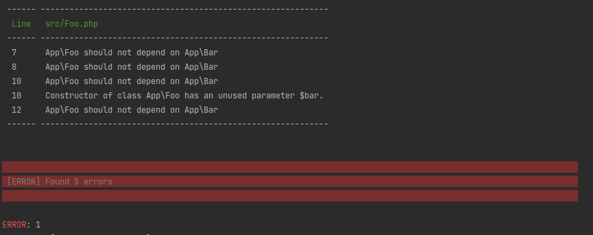

# PHPat - Define your application architecture by writing tests

by Ralf Junghans and Gerd Rönsch

__Proudly made with Marp (https://marpit.marp.app/)__

---

# Introduction


- Developing with PHP since 2006
- Works currently at Digistore24 GmbH
- Loves coding-rules and static code analysis

---

# Architecture Testing Tool Landscape

* Deptrac (https://github.com/qossmic/deptrac)
* PHPat (https://github.com/carlosas/phpat)
* PHPArkitect (https://github.com/phparkitect/arkitect)
* PHPArch (https://packagist.org/packages/j6s/phparch)
* NoColor (https://github.com/VKCOM/nocolor)

---

# PHPat vs Deptrac

## Why use PHPat?

* ✅ Easy to get started with
* ✅ Simple to read (Uses PHP-Code with Explicit Definition)
* ✅ Easy to introduce to legacy projects (Allows for Baseline)

## Why use Deptrac

* ✅ Stable code base with big community
* ✅ Has visualization

---

# Installation

```shell
composer require --dev phpstan/phpstan phpat/phpat
```

```yaml
# phpstan.neon
parameters:
  level: 1
  paths:
    - tests
    - src

includes:
  - vendor/phpat/phpat/extension.neon

services:
  - class: ArchitectureTests\SomeTest
    tags:
      - phpat.test
```

---

# The Building Blocks

* **Selectors** -- Which classes / traits / enums to test against

* **Assertions** -- Definition of boundaries and requirements

---

```php
# Class reference
Selector::classname(Foo::class);

# String class reference
Selector::classname('Foo\Bar');

# Regex
Selector::classname('/[A-Z][a-z]{2}\\Bar/', true);
```

---

```php
Selector::classname()

Selector::namespace()

Selector::interface()
```

```php
Selector::abstract()
Selector::final()

Selector::implements()
Selector::extends()

Selector::enum()
```

```php
Selector::all()
```

---

# Assertions

```php
# Inheritance
$selection->shouldExtend()
$selection->shouldNotExtend()
```

```php
# Interfaces
$selection->shouldImplement()
$selection->shouldNotImplement()
```

```php
# Construction
$selection->shouldNotConstruct()
```

---

```php
$selection->shouldNotDependOn()
```

```php
class Foo extends Bar
{
    private Bar $bar;
    private Bar $bar2;

    public function __construct(Bar $bar)
    {
        $this->bar2 = new Bar();
    }
}
```

---

# Example Test

---

```php
class SomeTest
{
    public function test_something(): Rule
    {
        return PHPat::rule()
            ->classes(Selector::classname(Foo::class))
            ->shouldNotDependOn()
            ->classes(Selector::classname(Bar::class))
        ;
    }
}
```

```php
class Foo extends Bar
{
    private Bar $bar;

    public function __construct(Bar $bar)
    {
        $this->bar = new Bar();
    }
}
```

---



---

# Adding a baseline

```shell
vendor/bin/phpstan analyze --generate-baseline
```

```yaml
# phpstan.neon
includes:
  - phpstan-baseline.neon
```

---


---

# Use-Cases

---

# Protect the Domain logic

---

```php
public function domain(): Rule
{
    return PHPat::rule()
        ->classes(Selector::namespace('App\Domain'))
        ->shouldNotDependOn()
        ->classes(Selector::all())
        ->excluding(Selector::namespace('App\Domain'))
    ;
}
```

---

# Reserving a Namespace for Commands

---

```php
public function commands(): Rule
{
    return PHPat::rule()
        ->classes(Selector::namespace('App\Command'))
        ->shouldExtend()
        ->classes(Selector::interface(CommandInterface::class))
    ;
}
```

___

# MVC

---

```php
public function controller(): Rule
{
    return PHPat::rule()
        ->classes(Selector::classname('/App\\(View|Model)\\.*', true))
        ->shouldNotDependOn()
        ->classes(Selector::classname('/App\\Controller\\.*', true))
    ;
}

public function views(): Rule
{
    return PHPat::rule()
        ->classes(Selector::classname('/App\\View\\.*', true))
        ->shouldNotDependOn()
        ->classes(Selector::classname('/App\\Model\\.*', true))
        ;
}

public function models(): Rule
{
    return PHPat::rule()
        ->classes(Selector::classname('/App\\Model\\.*', true))
        ->shouldNotDependOn()
        ->classes(Selector::classname('/App\\View\\.*', true))
        ;
}
```

---

# The Legacy Models

---


---

```php
public function only_extend_certain_models(): Rule
{
    return PHPAt::rule()
        ->classes(Selector::all())
        ->excluding(
            Selector::classname(Very_old_model1::class),
            Selector::classname(Very_old_model2::class),
            Selector::classname(Very_old_model3::class),
        )
        ->shouldNotExtend()
        ->classes(
            Selector::classname(Sql_Model::class),
            Selector::classname(Basic_Config::class),
            Selector::classname(Basic_Model::class),
        )
    ;
}
```

---

# Wrap Up

* PHPAt is a easy way to enforce architectural decisions
* You can start with failing tests to prevent further debt (using baselines)
* Architecture can be different, but it should be enforced in a project

---

**Thank you for joining today!**

https://github.com/roenschg/phpat-talk